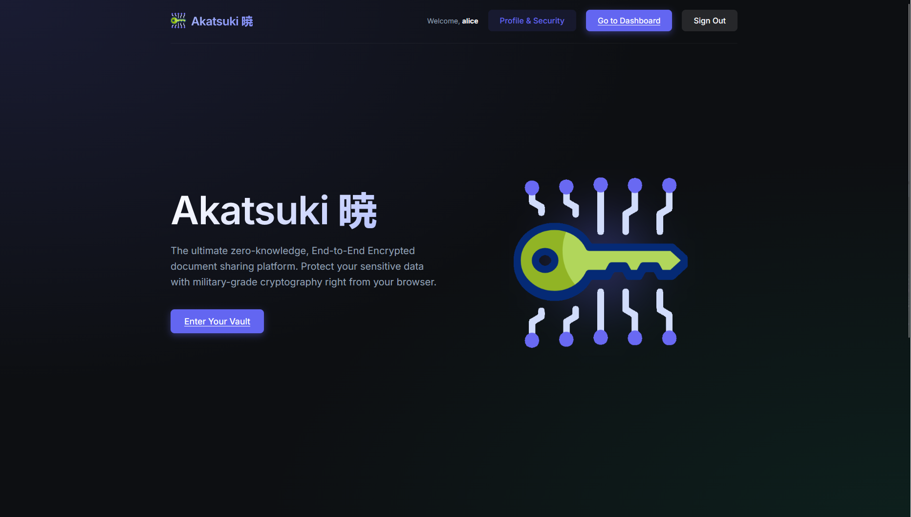
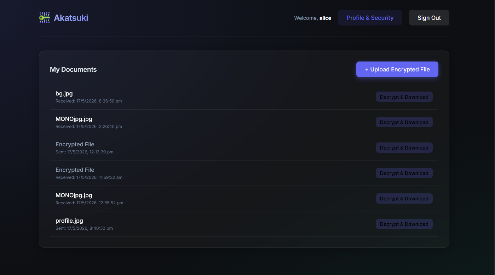
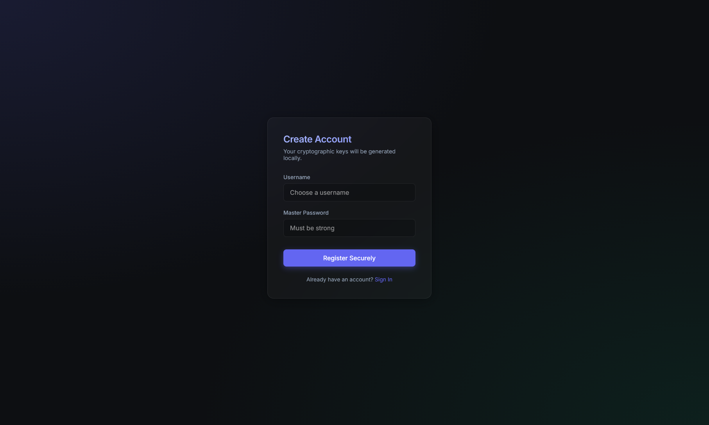
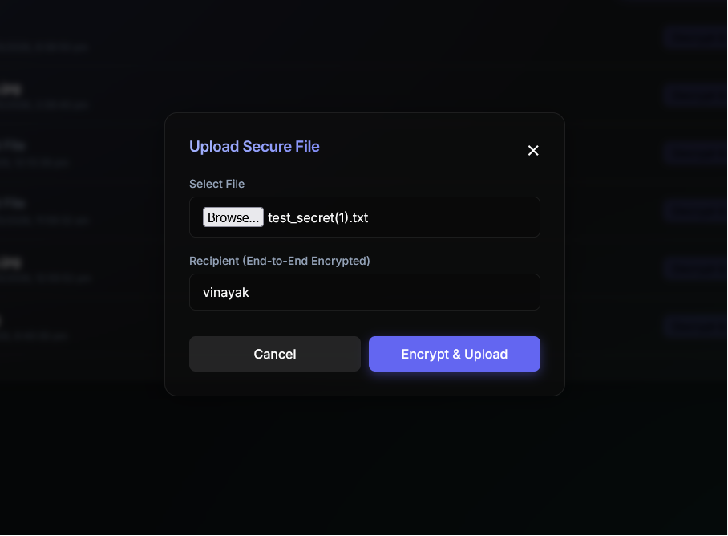

# Akatsuki 暁 



Akatsuki is a premium, true zero-knowledge, **End-to-End Encrypted (E2EE) document sharing platform**. Protect your sensitive data and metadata with military-grade cryptography right from your browser. 

The application utilizes a powerful hybrid cryptographic architecture combining the Native Web Crypto API on the client side with a robust Django backend. **The server never sees your plaintext passwords, your private cryptographic keys, or your unencrypted files.**

---

##  Key Features

### 1. True Zero-Knowledge Architecture
All encryption and decryption happens locally in your browser using the Native Web Crypto API. The server only ever receives and stores indistinguishable ciphertexts.

### 2. Hybrid Cryptography
- **File Contents & Metadata**: Encrypted using **AES-256-GCM**.
- **Key Exchange**: The AES keys are wrapped and exchanged using **RSA-OAEP**.
- **Private Key Storage**: Your RSA Private Key is symmetrically wrapped using a key derived from your Master Password via **PBKDF2** before it ever leaves your device.

### 3. Metadata Protection
Unlike standard platforms, Akatsuki encrypts your filenames. When you view your dashboard, your vault remains locked, showing only timestamps. By unlocking your vault, the browser bulk-decrypts the metadata locally to reveal the true filenames.

### 4. Premium Glassmorphic UI
Built with React and Vite, the frontend features a sleek, dark-mode glassmorphism design with dynamic animations, providing a beautiful user experience without compromising on hardcore security.

---

##  Screenshots

### Dashboard & Vault


### Secure Authentication


### E2EE File Upload


---

##  Technology Stack

- **Frontend**: React.js, Vite, Vanilla CSS, Web Crypto API (for native browser cryptography), Axios.
- **Backend**: Django, Django REST Framework, SimpleJWT (for authentication), SQLite (default).

---

##  How to Run Locally

### Prerequisites
- Python 3.10+
- Node.js 18+ & npm

### 1. Setup the Django Backend

Open a terminal and navigate to the root directory:

```bash
# Create a virtual environment (optional but recommended)
python -m venv venv
source venv/bin/activate  # On Windows use: venv\Scripts\activate

# Install required dependencies
pip install django djangorestframework djangorestframework-simplejwt django-cors-headers

# Apply database migrations
python manage.py makemigrations
python manage.py migrate

# Start the Django development server
python manage.py runserver
```

The backend API will start running on `http://127.0.0.1:8000`.

### 2. Setup the React Frontend

Open a **new** terminal and navigate to the frontend directory:

```bash
cd frontend

# Install dependencies
npm install

# Start the Vite development server
npm run dev
```

The frontend will start running on `http://localhost:5173`. 

---

##  Security Considerations & Flow
1. **Registration**: Your browser generates an RSA-OAEP key pair. The private key is encrypted with a PBKDF2 derivative of your password. Only the public key and the encrypted private key are sent to the server.
2. **Uploading**: A random AES-256-GCM key is generated. The file and filename are encrypted with this AES key. The AES key is then encrypted with the recipient's RSA Public Key (and your own, so you can read it later).
3. **Downloading**: You enter your Master Password to locally unwrap your RSA Private Key. Your RSA Private Key decrypts the AES key. The AES key decrypts the file bytes and triggers a secure local browser download.

---
*Developed as a highly secure, privacy-first web application standard.*
