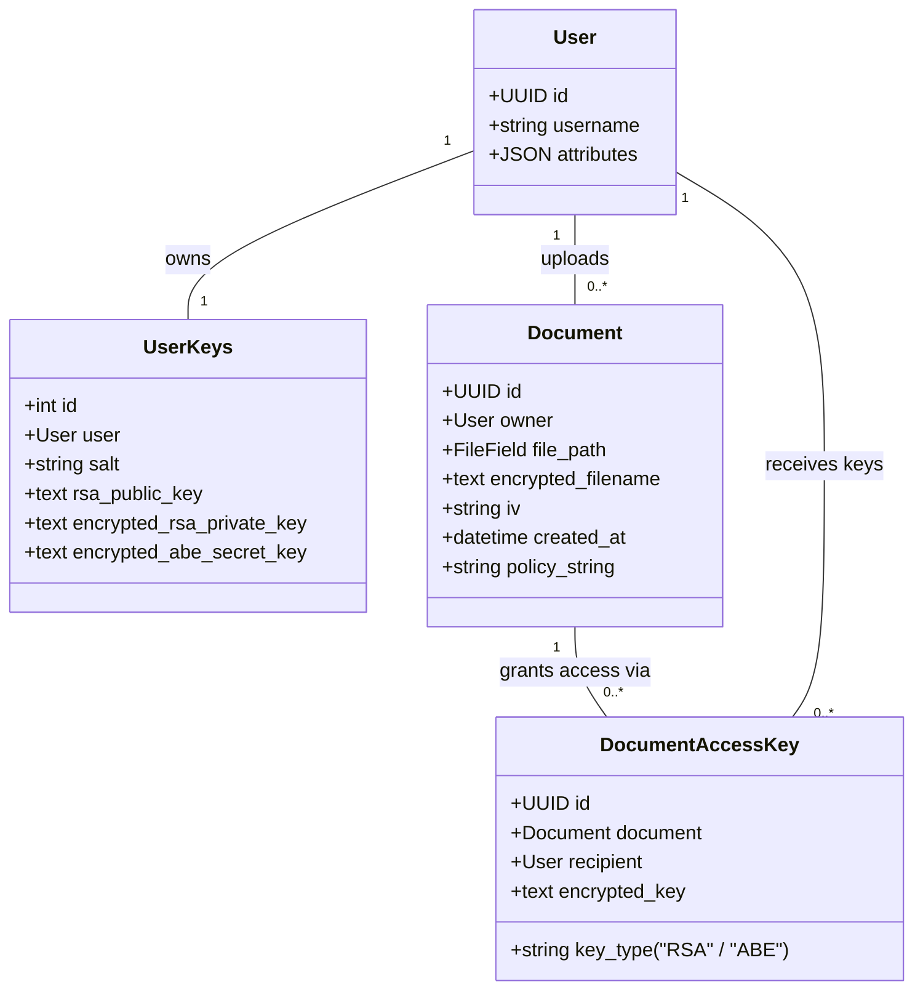
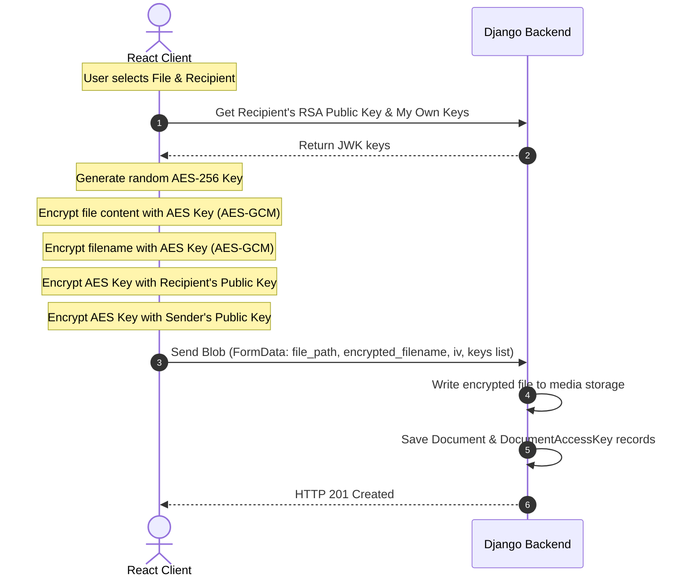

# Akatsuki (暁) - End-to-End Encrypted Document Vault & Sharing Platform

Welcome to the comprehensive technical documentation for **Akatsuki** (暁), a secure, zero-knowledge, end-to-end encrypted (E2EE) document storage and file-sharing web application. 

Akatsuki is architected around a core privacy principle: **confidential user data must never be exposed to the server in plaintext.** Cryptographic operations, including file encryption/decryption, metadata protection, and private key unwrapping, are executed locally within the client’s browser using the native web standards-based Web Crypto API. The server acts as a blind custodian, storing only ciphertexts, hashes, public keys, and securely wrapped credentials.

---

## Table of Contents
1. [Core Features](#1-core-features)
2. [Cryptographic Principles & Schemes](#2-cryptographic-principles--schemes)
3. [System Architecture & Technology Stack](#3-system-architecture--system-architecture--technology-stack)
4. [Database Models & Backend Schema](#4-database-models--backend-schema)
5. [Detailed Workflows & Cryptographic Protocols](#5-detailed-workflows--cryptographic-protocols)
   - [User Registration & Local Keypair Generation](#a-user-registration--local-keypair-generation)
   - [User Login & JWT Authentication](#b-user-login--jwt-authentication)
   - [Document Upload & Secure Hybrid Encryption](#c-document-upload--secure-hybrid-encryption)
   - [Vault Unlocking & Metadata Decryption](#d-vault-unlocking--metadata-decryption)
   - [Document Decryption & Download](#e-document-decryption--download)
   - [Password Change & RSA Private Key Re-wrapping](#f-password-change--rsa-private-key-re-wrapping)
6. [Frontend UI & Design System](#6-frontend-ui--design-system)
7. [Security Considerations & Hardening Guidelines](#7-security-considerations--hardening-guidelines)
8. [Local Development & Quickstart](#8-local-development--quickstart)

---

## 1. Core Features

- **Zero-Knowledge Architecture:** Plaintext documents, master passwords, and private decryption keys are processed strictly in-memory inside the client browser. They are never transmitted over the network or stored in databases.
- **Hybrid Cryptography:** Combines symmetric cryptography (AES-256-GCM) for ultra-fast and secure file/filename encryption with asymmetric cryptography (RSA-OAEP 4096-bit) for secure key encapsulation and sharing.
- **Metadata & Filename Obfuscation:** Unlike conventional storage platforms that expose file directory indexes, Akatsuki encrypts filenames locally. Before the vault is unlocked, all file listings are masked.
- **Multi-Recipient Decryption:** Uploader-specified recipient keys are wrapped using the recipient's public RSA key. The file AES key is also wrapped with the uploader's public key, ensuring both parties can access the file.
- **Local Vault Unlocking:** Re-authenticating with the master password locally derives key material that recovers the user's RSA private key, caching it temporarily in React state to enable immediate on-the-fly decryption of document lists.
- **Fine-Grained Security Management:** Dynamic profile management allowing users to update their master passwords. This process decrypts the RSA private key using the old password, derives a new wrapping key, and re-encrypts the private key before updating it on the server.
- **Future-Proof ABE Support:** Schema and endpoints are structured to accommodate Attribute-Based Encryption (ABE), enabling access control based on user attributes (e.g., role, department).

---

## 2. Cryptographic Principles & Schemes

Akatsuki leverages standard Web Crypto API primitives.

| Primitive / Protocol | Implementation Details | Purpose |
| :--- | :--- | :--- |
| **AES-256-GCM** | 256-bit symmetric keys, 12-byte random Initialization Vectors (IVs). | Symmetrically encrypts the document contents and the original filename. |
| **RSA-OAEP-4096** | 4096-bit key length, SHA-256 hashing, default public exponent `[1, 0, 1]` (`65537`). | Encapsulates the AES file encryption key for safe transit and sharing. |
| **PBKDF2** | 100,000 iterations, SHA-256 hash function, unique 16-byte random salts. | Derives an AES wrapping key from the user's master password to secure the private key. |
| **Base64 Encoding** | Standard base64 conversion for binary parameters (keys, IVs, ciphertexts). | Encodes binary cryptographic material into text safe for JSON/API transmission. |

### Diagram of Hybrid Cryptographic Architecture

```mermaid
graph TD
    subgraph Client Browser (Local Cryptography)
        File[Plaintext File] -->|AES-256-GCM| EncFile[Encrypted Ciphertext]
        AESKey[Random AES Key] -->|Encrypt File| File
        AESKey -->|RSA-OAEP Asymmetric Encryption| EncAESKey[Wrapped AES Key]
        PubKey[Recipient's RSA Public Key] -->|Wrap AES Key| AESKey
    end
    subgraph Django Server (Encrypted Storage)
        EncFile -->|Upload| DB_Doc[Document FileField]
        EncAESKey -->|Upload| DB_Key[DocumentAccessKey Table]
    end
```

---

## 3. System Architecture & Technology Stack

The application follows a decoupled client-server architecture:

```
[ React Client ]  <==== REST API / JWT ====>  [ Django REST Framework ]
       ||                                               ||
       \/                                               \/
[ Web Crypto API ]                              [ SQLite/PostgreSQL ]
```

### Technology Stack
- **Frontend Framework:** React 18, Vite (fast HMR, modular building).
- **Client Routing & Networking:** React Router DOM (v6), Axios (HTTP Client).
- **Local Storage / Caching:** Memory-based states (React `useState`) for keeping decrypted keys in memory, preventing persistence to unsafe storage mediums like `localStorage`.
- **Backend Framework:** Django (v5.2), Django REST Framework (DRF) for endpoints.
- **Authentication:** SimpleJWT (JSON Web Tokens) for API authorization.
- **Cors Middleware:** `django-cors-headers` to enable cross-origin browser transactions.
- **Database Engine:** SQLite (configured for local dev/testing), highly compatible with PostgreSQL.

---

## 4. Database Models & Backend Schema

The backend schema in `core/models.py` handles user records, public parameters, binary file pointers, and key mappings.



### Model Implementations Details:

1. **`User` (Custom AbstractUser):**
   - Implements UUIDs for primary keys to deter endpoint enumeration.
   - `attributes`: JSONField storing identity elements (e.g., `{"role": "Manager", "dept": "HR"}`) for policy-based authorization.

2. **`UserKeys`:**
   - Stores user-specific cryptographic properties.
   - `salt`: Base64 salt used for PBKDF2 key derivation.
   - `rsa_public_key`: Stored in plaintext (JWK format) so that other system users can fetch it to encrypt files for them.
   - `encrypted_rsa_private_key`: Protected under the user's PBKDF2 derived key. Structured as `iv:ciphertext` in Base64.

3. **`Document`:**
   - Represents the encrypted file pointer.
   - `file_path`: Points to the directory where the encrypted binary blob (`encrypted.bin`) is stored (e.g., `media/encrypted_docs/`).
   - `encrypted_filename`: Stored as `iv:ciphertext` to mask the name.
   - `iv`: Base64 initialization vector used during symmetric file content encryption.

4. **`DocumentAccessKey`:**
   - Maps decrypted keys to authorized users.
   - `key_type`: `RSA` or `ABE`.
   - `encrypted_key`: The symmetric `AES-256` key encrypted under the recipient's RSA public key (or future ABE policy keys).

---

## 5. Detailed Workflows & Cryptographic Protocols

### A. User Registration & Local Keypair Generation
During registration, the client generates keys and wraps the private key locally:

1. **Key Generation:**
   - Browser runs:
     ```javascript
     const keyPair = await window.crypto.subtle.generateKey(
         { name: "RSA-OAEP", modulusLength: 4096, publicExponent: new Uint8Array([1, 0, 1]), hash: "SHA-256" },
         true, ["encrypt", "decrypt"]
     );
     ```
2. **Public Key Export:**
   - Exports the public key to JSON Web Key (JWK) string representation.
3. **Password Key Derivation:**
   - Generates a random 16-byte salt (`saltStr`).
   - Runs PBKDF2 with 100,000 iterations to derive an AES-256 wrapping key (`derivedKey`).
4. **Private Key Wrapping:**
   - Exports the RSA private key in PKCS8 format.
   - Generates a random 12-byte IV.
   - Encrypts the PKCS8 private key with the derived key using `AES-GCM-256`.
   - Combines the IV and ciphertext into `iv:encryptedPrivateKey` (Base64).
5. **API Dispatch:**
   - Sends `username`, `password` (for DRF login verification), `salt`, `rsa_public_key`, and `encrypted_rsa_private_key` to `/api/auth/register/`.

---

### B. User Login & JWT Authentication
1. User supplies credentials to the login page.
2. React dispatches credentials to `/api/auth/login/`.
3. Django SimpleJWT returns access and refresh tokens.
4. Tokens are stored in browser local storage. Decryption key material is **not** cached or stored automatically during standard login.

---

### C. Document Upload & Secure Hybrid Encryption
When uploading a document, hybrid encryption is performed:



---

### D. Vault Unlocking & Metadata Decryption
Until the vault is unlocked, the dashboard shows encrypted labels. When the user enters their password to unlock the vault:

1. Client fetches user keys (`salt` and `encrypted_rsa_private_key`) via `/api/keys/me/`.
2. Computes the PBKDF2 key from the user's password and salt.
3. Splits the private key string by `:` to obtain the IV and ciphertext.
4. Decrypts the RSA private key.
5. For each document in the dashboard:
   - Client iterates over the document's `access_keys` to locate the `RSA` key matching the user.
   - Decrypts the AES key using the RSA private key.
   - Uses the decrypted AES key to decrypt the filename:
     ```javascript
     const [nameIv, nameEnc] = doc.encrypted_filename.split(':');
     const realName = await decryptString(nameEnc, nameIv, aesKey);
     ```
6. The decrypted filenames are mapped in component memory (`unlockedNames`), and the unwrapped RSA private key is stored in memory as `unlockedPrivateKey` so subsequent decryptions do not prompt for password entry.

---

### E. Document Decryption & Download
1. When a user clicks **Decrypt & Download**, the client uses the cached private key (`unlockedPrivateKey`) or prompts the user for their password to decrypt it on the fly.
2. Locates the matching `DocumentAccessKey` for the user.
3. Decrypts the encapsulated AES key with the RSA private key.
4. Downloads the encrypted binary blob from the backend storage using Axios:
   ```javascript
   const res = await axios.get(document.file_path, { responseType: 'arraybuffer' });
   ```
5. Decrypts the binary payload:
   ```javascript
   const decryptedBuffer = await decryptFile(res.data, document.iv, aesKey);
   ```
6. Decrypts the original filename.
7. Triggers a secure local file download by creating a virtual `<a>` tag pointing to an object URL:
   ```javascript
   const blob = new Blob([decryptedBuffer], { type: 'application/octet-stream' });
   const url = URL.createObjectURL(blob);
   ```

---

### F. Password Change & RSA Private Key Re-wrapping
Updating user credentials requires re-wrapping key material:

1. User provides `oldPassword` and `newPassword`.
2. Client fetches the current `salt` and `encrypted_rsa_private_key`.
3. Derives the old key using `oldPassword` and the old salt, then unwraps the RSA private key.
4. Generates a fresh random salt.
5. Derives a new key using `newPassword` and the new salt.
6. Wraps the RSA private key with the new key and a new random IV.
7. Transmits the payload (`old_password`, `new_password`, `new_salt`, `new_encrypted_rsa_private_key`) to `/api/auth/change-password/`.
8. Django validates the user credentials, updates the authentication password hash, and saves the new cryptographic materials.

---

## 6. Frontend UI & Design System

Akatsuki features a premium, responsive glassmorphism visual layout built with vanilla CSS.

### Global Style Variables (`frontend/src/index.css`)
```css
:root {
  --bg-color: #0d0f12;
  --text-color: #e2e8f0;
  --accent-color: #6366f1;
  --accent-hover: #4f46e5;
  --glass-bg: rgba(255, 255, 255, 0.03);
  --glass-border: rgba(255, 255, 255, 0.08);
  --input-bg: rgba(0, 0, 0, 0.2);
  --danger-color: #ef4444;
  --success-color: #10b981;
}
```

### Visual Enhancements
- **Ambient Lighting:** Fixes deep dark background gradients using floating radial glow structures:
  ```css
  background-image: 
    radial-gradient(at 0% 0%, rgba(99, 102, 241, 0.15) 0px, transparent 50%),
    radial-gradient(at 100% 100%, rgba(16, 185, 129, 0.1) 0px, transparent 50%);
  ```
- **Glassmorphic Panes:** Uses `backdrop-filter: blur(16px)` and subtle borders to build layers that mimic frosted glass.
- **Float Animation:** The homepage showcases interactive elements that float smoothly:
  ```css
  @keyframes float {
    0% { transform: translateY(0px); }
    50% { transform: translateY(-20px); }
    100% { transform: translateY(0px); }
  }
  ```
- **Typography:** Uses Google Fonts' **Inter** typeface with custom letter-spacing (`-0.02em`) for a modern interface.

---

## 7. Security Considerations & Hardening Guidelines

While Akatsuki offers strong end-to-end security, deploying this platform in production environments warrants attention to the following areas:

1. **Key Loss Recovery:** Because the platform is zero-knowledge, if a user loses their master password, they lose the ability to derive the private key decryption wrapper. Document content and metadata access becomes permanently unrecoverable.
2. **Client-Side Key Caching:** The unwrapped private key is kept in React state. Avoid storing the raw key in persistent mechanisms like `localStorage` or `sessionStorage` to mitigate risks from Cross-Site Scripting (XSS).
3. **Transport Layer Security (TLS):** Deployments must enforce HTTPS. Without TLS, attackers could perform man-in-the-middle attacks to modify frontend scripts and harvest private keys or master passwords.
4. **File Signature Checks:** Although AES-GCM guarantees data integrity (using authentication tags), the system does not sign files using the user's RSA private key. Future iterations could add RSA signatures to prevent the server from tampering with files.
5. **Secure Storage in Cloud Deployments:** In staging/production, configure Django's file storage backend (e.g., django-storages) to store files in private S3 buckets.

---

## 8. Local Development & Quickstart

### Prerequisites
- **Python 3.10+**
- **Node.js 18+**

### Backend Setup
```bash
# Clone the repository
cd akatsuki

# Create and activate virtual environment
python -m venv venv
# On Windows:
venv\Scripts\activate
# On macOS/Linux:
source venv/bin/activate

# Install dependencies
pip install django djangorestframework djangorestframework-simplejwt django-cors-headers

# Run database migrations
python manage.py migrate

# Start Django development server
python manage.py runserver
```
The Django server runs on **http://127.0.0.1:8000**.

### Frontend Setup
```bash
# Navigate to frontend folder
cd frontend

# Install node dependencies
npm install

# Run Vite dev server
npm run dev
```
The frontend application will be hosted locally on **http://localhost:5173**.
Vite is configured with a proxy forwarding `/api` paths directly to the Django server.
